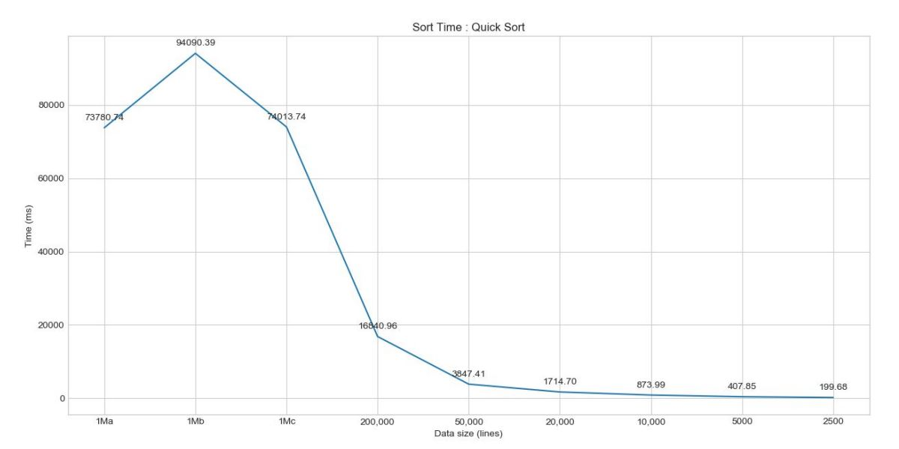

# Algorithms
 This repository contains code for different algorithms implemented as part of coursework at NCSU
 
__Sorting__

In this assignment, 3 sorting algorithms were implemented: bubble sort, quick sort, and
merge sort and compared again files of different sizes starting from 2500 lines to 1 million lines

The following plots are recorded for growth of sorting time as a function of data size:

Note, that in bubble sort, for 1Ma, 1Mb, 1Mc, only 50000 lines are used due to
excessive time requirements

